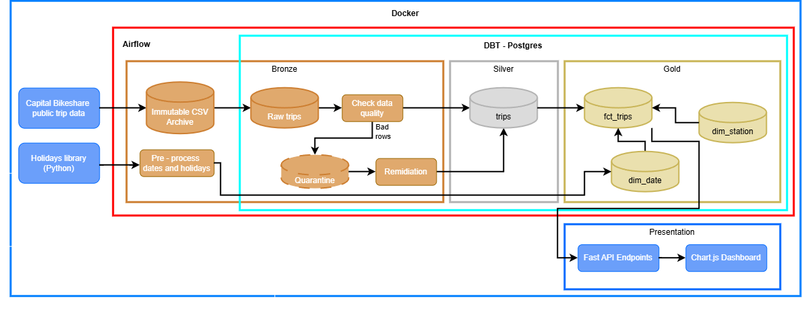

# Capital Bikeshare — End-to-End

An ELT pipeline that ingests publicly available Capital Bikeshare trip data into a medallion-architecture warehouse, validates and remediates it, and serves the result through a REST API and dashboard.

The entire stack runs in Docker. `docker compose up` brings up everything.

Stack: Python · PostgreSQL 16 · dbt 1.10 · Apache Airflow 3.3 · Docker Compose · FastAPI

## Schematic


Two sources feed the platform: raw trip files from Capital Bikeshare, and a Python holidays library used to build the date dimension.

## Design decisions

The choices worth explaining, and why.

### Files are the source of truth, not the bronze table

The durable raw layer is the immutable CSV archive on disk. The `raw trips` table in
Postgres is disposable — rebuilt from those files on each run.

The tradeoff is deliberate: keeping raw history in files rather than the warehouse means
the database stays small and resettable, and a corrupted load is fixed by re-running rather
than restoring a backup. The cost is that querying historical raw data means reloading it,
and backfills depend on the archive being intact. At production scale the raw layer would
move to object storage with partitioned Parquet.

### Validation happens in bronze, before silver exists

Data quality checks run against `raw trips` and route failures out before anything reaches
silver. Silver is therefore curated by construction — no downstream model ever has to
defend against malformed input.

The alternative (validate in silver, keep bronze a faithful source mirror) is equally
defensible. This project chose bronze-side validation so that the boundary between "raw"
and "trustworthy" is a single explicit step rather than a property scattered across models.

### Quarantine instead of discard

Data quality tests run with `store_failures: true`, so failing rows are persisted
rather than reported and forgotten. dbt writes one table per test into the audit
schema, each holding the rows that violated that specific rule:

- **Station name drift** — the same station ID under multiple names across months, caught
  with a `GROUP BY … HAVING COUNT(DISTINCT …) > 1` CTE
- **Null required fields** — `NULLIF(TRIM(col), '') IS NULL`, text columns only
- **Implausible durations** — via `EXTRACT(EPOCH FROM …)`; the distribution breaks cleanly
  between normal rides (p99 ≈ 69 min) and lost-bike anomalies (max ≈ 1500 min)

Because failures are separated by rule rather than pooled into one table, each
remediation strategy reads only the rows it can actually fix — the name-drift
repair never has to filter out duration outliers.

Silver excludes these rows via a `NOT EXISTS` anti-join, so the curated layer is
clean by construction while nothing is lost.

### Remediation closes the loop

Quarantine alone only defers the problem. A remediation step repairs what it can and merges
those rows back into silver.

The main case is trips with missing station IDs but valid coordinates: these are snapped to
the nearest known station within **50 m** using `CROSS JOIN LATERAL … ORDER BY dist LIMIT 1`,
and flagged with boolean columns so consumers can separate measured from inferred values.

< !-- Roughly **40%** of ingested rows are quarantined; **80%** of those are recovered, leaving under **[X]%** genuinely unusable. --> 

### Timezone correctness

Source timestamps are naive local time. Reading them as UTC silently shifts every evening
trip to the next day — producing plausible-looking but wrong daily counts. Handled
explicitly with `AT TIME ZONE 'America/New_York'`.

### `NOT EXISTS`, not `NOT IN`

The anti-join excluding quarantined rows uses `NOT EXISTS`. `NOT IN` returns zero rows if
the subquery contains a single NULL — a silent wrong-answer bug rather than a loud failure.

### Separate warehouse from orchestrator metadata

Airflow's metadata database and the analytical warehouse are two different Postgres
instances. Analytical rebuilds shouldn't contend with the scheduler writing task state.
The warehouse is exposed on host port `5433`.

### dbt isolated inside the Airflow image

dbt lives in its own virtualenv at `/opt/airflow/dbt_venv` rather than the Airflow
environment, because their dependency trees conflict. This avoids mounting the Docker
socket into Airflow while keeping dbt failures visible directly in Airflow task logs.

---

## Data quality testing

**11** dbt tests run as part of `dbt build`, covering uniqueness, not-null, accepted
values, and referential integrity.

One worth calling out: a `relationships` test on `end_stn_id` surfaced **8 stations that
only ever appeared as trip destinations**, never origins. The station dimension had been
built from start stations alone. The fix was to UNION both sides — a gap that would have
silently under-counted destination-side analytics.

That test failing is the system working.

---

## Running it

```bash
git clone https://github.com/YOUR_HANDLE/CapBikeEndToEnd.git
cd CapBikeEndToEnd

cp .env.example .env          # set FERNET_KEY and WAREHOUSE_PASSWORD
docker compose up -d
```

| service | URL |
|---|---|
| Airflow | http://localhost:8080 |
| Dashboard / API | http://localhost:8501 |
| Warehouse (Postgres) | `localhost:5433` |

Trigger the pipeline DAG from the Airflow UI, or run the transforms directly:

```bash
docker compose exec airflow-worker bash
cd /opt/airflow/dbt/cp_bikeshare
dbt build --target container
```

Inspect quarantine by reason:

```bash
docker compose exec warehouse psql -U bikeshare -d bikeshare -c \
  "select failed_rule, count(*) from bronze.quarantine group by 1 order by 2 desc"
```

---

## Data model

Star schema in the gold layer:

| table | grain |
|---|---|
| `fct_trips` | one row per trip |
| `dim_station` | one row per station, unioned from trip origins and destinations |
| `dim_date` | one row per calendar date, with holiday flags |

## Layout

```
├── airflow/            # custom image; dbt installed to isolated venv
├── dags/               # pipeline DAG
├── dbt/cp_bikeshare/
│   ├── models/
│   │   ├── bronze/     # raw trips, data quality, quarantine, remediation
│   │   ├── silver/     # trips
│   │   └── gold/       # fct_trips, dim_station, dim_date
│   ├── macros/         # generate_schema_name override
│   └── tests/
├── dashboard/          # FastAPI service + static frontend
├── data/bronze/        # immutable CSV archive (bind mount)
└── docker-compose.yaml
```

CSVs load with `COPY … FROM STDIN` rather than server-side `COPY`, so Postgres stays a
stock image with no bind mounts of its own.

---

## Known gaps

Being explicit about what isn't finished:

- Weather enrichment (open-meteo) is designed but not yet wired in
- No CI — running `dbt build` on push is the next addition
- Remediation currently handles station imputation only; duration and name-drift cases
  remain terminal

---

## Notes

Originally built on DuckDB and migrated to PostgreSQL 16 after a compatibility gap between
dbt-core 1.12 and dbt-duckdb. The migration is in the commit history; most of the work was
dialect differences — `DATETIME` → `TIMESTAMP`, numeric casting for `ROUND`, and
lowercasing every identifier after a case-sensitivity collision between `BRONZE` and
`Bronze` cost a debugging session.